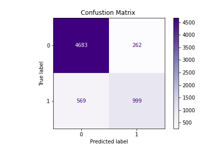

---
### Introduction

In data science, no predictive model can ever be fast, cheap and good. Good work can be done quickly, but that won't be cheap. Good work can also be done for cheap, but that won't be done in a timely fashion. This project aimed to explore the tradeoffs between the three components and see which of the three tradeoffs was in fact the least important.

As part of a competition, our goal was to create a top performing classification model aimed to predict if an individual's income was above a threshold of $50,000. However, the important catch to note was that our model would be constrained to a maximum of 20 features given the rules of the competition. Other groups faced similar restraints, for example, as some were limited to a smaller initial dataset, while others would only be allowed to test one type of model.  

The data given had 14 features and information about 32,561 individuals. The descriptive features included but were not limited to the individuals age, marital status, education level and sex.

### Data Dictionary

|Feature|Type|Dataset|Description|
|---|---|---|---|
|'marital-status_ Married-civ Spouse|int|1-group-submission.csv|Individual married|
|education-num|int|1-group-submission.csv|Level of education|
|age|int|1-group-submission.csv|Age of individual|
|hours-per-week|int|1-group-submission.csv|Hours worked per week|
|capital-gain|int|1-group-submission.csv|Capital-gains|
|sex|int|1-group-submission.csv|Gender|
|occupation_ Exec-managerial|int|1-group-submission.csv|Executive-managerial occupation|
|occupation_ Prof-specialty|int|1-group-submission.csv|Specialty professor occupation|
|education_ Bachelors|int|1-group-submission.csv|Bachelors degree|
|education_ Masters|int|1-group-submission.csv|Masters degree|
|education_ Prof-school|int|1-group-submission.csv|School professor occupation|
|capital-loss|int|1-group-submission.csv|Capital-losses|
|workclass_ Self-emp-inc|int|1-group-submission.csv|Self-employed incorpororated business|
|relationship_ Wife|int|1-group-submission.csv|Wife|
|workclass_ Federal-gov|int|1-group-submission.csv|Federal-government employment|
|native-country_ United-States|int|1-group-submission.csv|Native country United States|
|workclass_ Local-gov|int|1-group-submission.csv|Local-government employment|
|workclass_ Self-emp-not-inc|int|1-group-submission.csv|Self-employed not incorporated business|
|occupation_ Protective-serv|int|1-group-submission.csv|Protective service occupation|

### Analysis and Modeling
After cleaning the dataset and dummifying categorical variables, we were able to feature engineer 20 of the highest correlated features (both positively and negatively correlated). These final features can be found above in the data dictionary. Using only these features due to the feature constraint in the competition guidelines, the first model we tried was a Logistic Regression. Keeping in mind a baseline score 79.2%, the Logistic Regression predicted on the test split with 85% accuracy. Additional models included a random forest, k-nearest neighbors, support vector machine, and an AdaBoost. These 4 models predicted with lesser accuracy scores than the Logistic Regression. The last model tested was an XG Boost Classifier, which  returned the highest accuracy score of 87.2% on the test data, 8% higher than the baseline predictive score. The following figure shows which values were correctly identified and which were misidentified in the testing split of the training datafame.

From the confusion matrix above we can gather that the Specificity is 95%, indicating that the model was able to correctly predict the incomes below $50,000 95% of the time. The Sensitivity however, was much lower at 64%, indicating that the model was less often able to predict incomes above 50k correctly. The overall misclassification rate for this model was 13%, indicating that 13% of values were incorrectly predicted to be either above or below the target income  threshold of $50,000.

### Conclusion and Recommendations
After seeing how well our model predicted incomes using just 20 features, we put it to the test on the entire features list. Using the optimized parameters we identified using GridSearchCV on the feature subset, and all 97 features our model improved, but only by an accuracy of .2% more. While this model was more accurate, we found that the cost/benefit of adding the additional features was not significant in this case and our model with the limited features was sufficient.

### Group Members
Katharine King, N.A. Kovacs, Will Hanley, Young Park
